# 📘 Projeto SAEP – Participação no GitHub

Bem-vindo(a) ao repositório oficial do **Projeto SAEP**! 🚀  
Aqui vamos aprender, colaborar e construir juntos.  

---

## ✅ Pré-requisitos
Antes de participar, garanta que você tenha:
- Uma conta no [GitHub](https://github.com/).
- Git instalado no computador → [Download Git](https://git-scm.com/).
- Editor de código (sugestão: [VS Code](https://code.visualstudio.com/)).

---

## 🔗 Como participar

### 1. Faça um fork do repositório
- Entre neste link: [Projeto SAEP](https://github.com/karizeviecelli/projeto_Saep).
- Clique no botão **Fork** no canto superior direito.
- Agora você terá uma cópia do projeto no seu perfil do GitHub.

### 2. Clone o repositório forkado
No terminal do seu computador, rode o comando:
```bash
git clone https://github.com/seu-usuario/projeto_Saep.git
```
*(Troque `seu-usuario` pelo seu nome de usuário do GitHub.)*

### 3. Crie uma branch para sua tarefa
```bash
git checkout -b minha-tarefa
```

### 4. Faça suas alterações
- Edite, adicione ou crie novos arquivos conforme orientação da professora.
- Siga a estrutura de pastas definida no projeto.

### 5. Salve suas mudanças
```bash
git add .
git commit -m "Descrição clara do que foi alterado"
```

### 6. Envie para o GitHub
```bash
git push origin minha-tarefa
```

### 7. Abra um Pull Request (PR)
- No seu repositório forkado, clique em **Compare & Pull Request**.
- Escreva um resumo do que você fez.
- Clique em **Create Pull Request** para enviar sua contribuição ao projeto principal.

---

## 📂 Estrutura do Repositório
- `docs/` → Documentos e relatórios.
- `src/` → Código-fonte.
- `assets/` → Imagens, logos e recursos visuais.
- `README.md` → Este guia.

---

## 🎯 Boas práticas
- Use nomes claros para as branches (ex: `feature-formulario`, `correcao-bug-x`).
- Escreva commits objetivos (ex: `adiciona validação no cadastro`).
- Teste o código antes de enviar.
- Ajude revisando o PR dos colegas.

---

## 🗺️ Fluxo de Trabalho (Workflow)

```mermaid
flowchart LR
    A[Fork do Repositório] --> B[Clone para sua máquina]
    B --> C[Criar nova Branch]
    C --> D[Fazer alterações no código]
    D --> E[Commit das mudanças]
    E --> F[Push para o GitHub]
    F --> G[Abrir Pull Request]
    G --> H[Revisão e Aprovação]
    H --> I[Merge no projeto principal]
```



---

## 🙋 Dúvidas?
- Pergunte no grupo da turma.
- Consulte a [documentação oficial do GitHub](https://docs.github.com/).
- Procure a professora.  

---

👉 *Cada contribuição sua faz o projeto crescer e ajuda você a aprender práticas usadas no mercado!* 💻🌟
